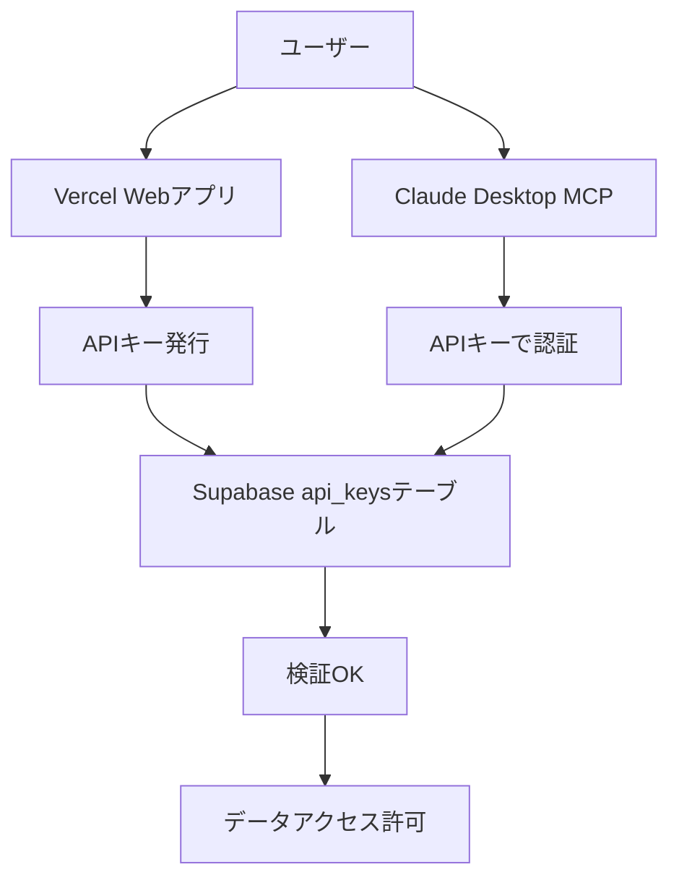

# 🔐 セキュアMCPサーバー設定ガイド

Vercelで発行されたAPIキーをSupabaseで検証する、セキュアな連携システム

## 🏗️ アーキテクチャ



## 📋 仕組み

### 1. APIキー発行（Vercel）
- ユーザーが https://xbrl-api-minimal.vercel.app でアカウント作成
- APIキーを発行（例: `xbrl_live_xxxxx`）
- SHA256ハッシュ化してSupabaseに保存

### 2. APIキー検証（MCP → Supabase）
- MCPサーバーがAPIキーをSupabaseで検証
- 有効期限、レート制限、プランをチェック
- 使用状況を記録

### 3. アクセス制御
- **無料プラン**: 基本検索のみ（5件まで）
- **ベーシック**: 財務データアクセス（最新1年）
- **プロ**: 全機能・全期間アクセス

## 🚀 セットアップ

### 1. APIキー取得

```bash
# Vercelアプリにアクセス
https://xbrl-api-minimal.vercel.app

# アカウント作成後、ダッシュボードでAPIキー取得
```

### 2. MCPサーバー設定

`%APPDATA%\Claude\claude_desktop_config.json`:

```json
{
  "mcpServers": {
    "xbrl-secure": {
      "command": "npx",
      "args": ["@xbrl-jp/mcp-server", "--secure"],
      "env": {
        "XBRL_API_KEY": "xbrl_live_your_key_here",
        "SUPABASE_URL": "https://zxzyidqrvzfzhicfuhlo.supabase.co",
        "SUPABASE_ANON_KEY": "public_anon_key"
      }
    }
  }
}
```

## 🔒 セキュリティ機能

### APIキー検証
```javascript
// SHA256ハッシュで保存・検証
const hashedKey = crypto.createHash('sha256')
  .update(apiKey)
  .digest('hex');

// Supabaseで検証
const { data } = await supabase
  .from('api_keys')
  .select('*')
  .eq('key_hash', hashedKey)
  .eq('is_active', true);
```

### レート制限
- **無料**: 100リクエスト/時
- **ベーシック**: 500リクエスト/時
- **プロ**: 無制限

### アクセスログ
```sql
-- api_usageテーブルで全アクセス記録
INSERT INTO api_usage (
  api_key_id,
  endpoint,
  request_count,
  last_used
)
```

## 📊 プラン別機能

| 機能 | 無料 | ベーシック | プロ |
|------|------|------------|------|
| 企業検索 | ✅ 5件 | ✅ 50件 | ✅ 無制限 |
| 財務データ | ❌ | ✅ 最新1年 | ✅ 全期間 |
| 企業比較 | ❌ | ✅ 3社 | ✅ 無制限 |
| API制限 | 100/時 | 500/時 | 無制限 |
| サポート | ❌ | メール | 優先 |

## 🛠️ 管理者向け設定

### Supabaseテーブル構造

```sql
-- api_keysテーブル
CREATE TABLE api_keys (
  id UUID PRIMARY KEY,
  user_id UUID REFERENCES auth.users,
  key_hash TEXT UNIQUE,
  prefix TEXT,
  suffix TEXT,
  is_active BOOLEAN DEFAULT true,
  rate_limit_per_hour INTEGER DEFAULT 100,
  expires_at TIMESTAMP,
  created_at TIMESTAMP DEFAULT NOW()
);

-- api_usageテーブル
CREATE TABLE api_usage (
  id SERIAL PRIMARY KEY,
  api_key_id UUID REFERENCES api_keys,
  endpoint TEXT,
  request_count INTEGER DEFAULT 0,
  last_reset TIMESTAMP DEFAULT NOW(),
  last_used TIMESTAMP DEFAULT NOW()
);

-- profilesテーブル
CREATE TABLE profiles (
  id UUID PRIMARY KEY REFERENCES auth.users,
  subscription_plan TEXT DEFAULT 'free',
  company_name TEXT,
  created_at TIMESTAMP DEFAULT NOW()
);
```

### Row Level Security (RLS)

```sql
-- APIキーは自分のもののみ参照可能
CREATE POLICY "Users can view own API keys" ON api_keys
  FOR SELECT USING (auth.uid() = user_id);

-- 使用状況も自分のもののみ
CREATE POLICY "Users can view own usage" ON api_usage
  FOR SELECT USING (
    api_key_id IN (
      SELECT id FROM api_keys WHERE user_id = auth.uid()
    )
  );
```

## 🔧 トラブルシューティング

### APIキーが無効と表示される

1. キーが正しくコピーされているか確認
```bash
echo %XBRL_API_KEY%
```

2. Vercelダッシュボードで有効期限確認
3. レート制限に達していないか確認

### アクセス拒否される

```javascript
// MCPサーバーのログを確認
[AUTH] Invalid API key
[AUTH] Rate limit exceeded
[AUTH] API key expired
```

### データが取得できない

- プランの制限を確認
- 年度指定が正しいか確認（無料は最新1年のみ）

## 📈 使用状況の確認

Claude Desktopで実行:
```
「APIステータスを確認して」
```

出力例:
```
✅ APIキー: 有効
プラン: ベーシック
レート制限: 450/500 リクエスト/時
有効期限: 2025-12-31
```

## 🔄 APIキーのローテーション

定期的にキーを更新することを推奨:

1. Vercelダッシュボードで新キー発行
2. 古いキーを無効化
3. MCPサーバー設定を更新
4. Claude Desktop再起動

## 🆘 サポート

- **無料プラン**: GitHubイシュー
- **ベーシック**: support@xbrl.jp
- **プロ**: 優先サポート（24時間以内）

---

最終更新: 2025年8月27日