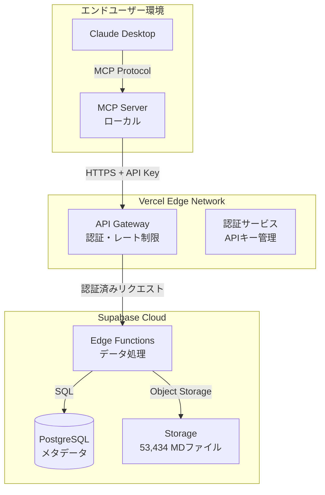

# XBRL Financial Data API - システムアーキテクチャ

## 🏗️ システム全体像



## 📊 各コンポーネントの役割

### 1. **Claude Desktop + MCP Server** (ユーザー側)
```javascript
// ユーザーのローカル環境で動作
{
  "mcpServers": {
    "xbrl-financial": {
      "command": "node",
      "args": ["mcp-server.js"],
      "env": {
        "API_KEY": "xbrl_xxxxx",  // Vercelで発行
        "API_URL": "https://xbrl-api.vercel.app"
      }
    }
  }
}
```

**役割:**
- Claude Desktopからの自然言語リクエストを受付
- APIリクエストに変換
- レスポンスをClaude用に整形

### 2. **Vercel** (APIゲートウェイ・認証)
```typescript
// pages/api/v1/companies/[id]/files.ts
export default async function handler(req, res) {
  // APIキー検証
  const apiKey = req.headers['x-api-key'];
  const isValid = await validateApiKey(apiKey);
  
  if (!isValid) {
    return res.status(401).json({ error: 'Unauthorized' });
  }
  
  // Supabaseへプロキシ
  const data = await supabase
    .from('financial_reports')
    .select('*')
    .eq('company_id', req.query.id);
    
  // 使用量記録
  await trackUsage(apiKey, req.path);
  
  return res.json(data);
}
```

**役割:**
- APIキーの発行・管理
- 認証・認可
- レート制限
- 使用量トラッキング
- Supabaseへのセキュアなプロキシ

### 3. **Supabase** (データストレージ・処理)
```sql
-- データ構造
CREATE TABLE companies (
  id TEXT PRIMARY KEY,
  name TEXT,
  ticker TEXT,
  industry TEXT
);

CREATE TABLE financial_reports (
  id UUID PRIMARY KEY,
  company_id TEXT REFERENCES companies(id),
  fiscal_year INTEGER,
  section TEXT,
  storage_path TEXT  -- Storage内のパス
);

-- Storage構造
-- /markdown-files/
--   /2021/
--     /S100LJ4F/
--       - 0000000_header.md
--       - 0101010_overview.md
--       - ...（10-25ファイル）
```

**役割:**
- 53,434個のMarkdownファイル保管
- メタデータ管理（PostgreSQL）
- Edge Functionsでデータ処理
- リアルタイムサブスクリプション

## 🔄 データフロー

### ユーザーリクエストの流れ

1. **ユーザー → Claude Desktop**
   ```
   「亀田製菓の2021年の財務状況を教えて」
   ```

2. **Claude → MCP Server**
   ```javascript
   // MCPツール呼び出し
   {
     tool: "get_financial_overview",
     args: { company_id: "S100LJ4F", year: 2021 }
   }
   ```

3. **MCP Server → Vercel API**
   ```http
   GET https://xbrl-api.vercel.app/api/v1/companies/S100LJ4F/files?year=2021
   Headers: X-API-Key: xbrl_user_key_xxxxx
   ```

4. **Vercel → Supabase**
   ```javascript
   // Vercel Edge Function
   const { data: files } = await supabase.storage
     .from('markdown-files')
     .list('2021/S100LJ4F');
   
   const { data: content } = await supabase.storage
     .from('markdown-files')
     .download('2021/S100LJ4F/0101010_overview.md');
   ```

5. **レスポンスの返却**
   ```
   Supabase → Vercel → MCP → Claude → ユーザー
   ```

## 💰 料金プラン実装

### Vercel側（APIキー管理）
```typescript
// APIキーとプランの管理
interface ApiKey {
  key: string;
  plan: 'free' | 'basic' | 'pro';
  company_id: string;
  created_at: Date;
  expires_at: Date;
  usage_limit: number;
  current_usage: number;
}

// プラン別制限
const PLAN_LIMITS = {
  free: {
    requests_per_month: 1000,
    years_accessible: [2021],  // 直近1年のみ
    rate_limit: '10/min'
  },
  basic: {
    requests_per_month: 10000,
    years_accessible: [2019, 2020, 2021],  // 3年分
    rate_limit: '60/min'
  },
  pro: {
    requests_per_month: -1,  // 無制限
    years_accessible: 'all',
    rate_limit: '600/min'
  }
};
```

## 🚀 デプロイ構成

### 1. Supabase（既存）
- ✅ すでに53,434ファイルアップロード済み
- ✅ PostgreSQLデータベース稼働中
- 追加作業: Edge Functions作成

### 2. Vercel（新規）
```bash
# デプロイコマンド
vercel deploy --prod

# 環境変数設定
SUPABASE_URL=https://zxzyidqrvzfzhicfuhlo.supabase.co
SUPABASE_SERVICE_KEY=eyJhbGc...
STRIPE_SECRET_KEY=sk_live_...
```

### 3. MCP Server（ユーザー配布）
```json
// NPMパッケージとして公開
{
  "name": "@xbrl/mcp-client",
  "version": "1.0.0",
  "bin": {
    "xbrl-mcp": "./bin/mcp-server.js"
  }
}
```

## 🔐 セキュリティ設計

### 多層防御
1. **APIキー認証** (Vercel)
2. **レート制限** (Vercel Edge)
3. **Row Level Security** (Supabase)
4. **ネットワーク制限** (Supabase)

### APIキーローテーション
```typescript
// 自動ローテーション
async function rotateApiKey(userId: string) {
  const newKey = generateSecureKey();
  await invalidateOldKey(userId);
  await createNewKey(userId, newKey);
  await notifyUser(userId, newKey);
}
```

## 📈 スケーリング戦略

### 現在の負荷
- データ: 53,434ファイル（約1GB）
- 想定ユーザー: 1,000+
- 想定リクエスト: 100万/月

### スケーリング計画
1. **Vercel Edge Functions**: 自動スケール
2. **Supabase Storage**: CDN統合
3. **PostgreSQL**: Read Replicaの追加
4. **Redis Cache**: 頻繁アクセスデータ

## 🎯 実装優先順位

### Phase 1: MVP（1週間）
- [x] Supabaseデータ準備
- [x] Express API（ローカルテスト）
- [x] MCP Server基本実装
- [ ] Vercelデプロイ
- [ ] APIキー認証

### Phase 2: 本番対応（2週間）
- [ ] 料金プラン実装
- [ ] 使用量トラッキング
- [ ] レート制限
- [ ] エラーハンドリング

### Phase 3: 拡張機能（3週間）
- [ ] AI分析連携
- [ ] データ可視化
- [ ] Webhook通知
- [ ] 管理ダッシュボード

---

最終更新: 2025年8月15日