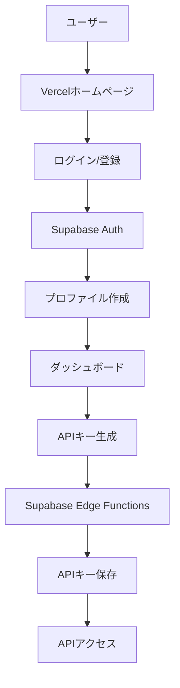

# XBRL API 統合ガイド

## 🌐 システム構成

### Vercelアプリケーション（フロントエンド）
- **URL**: https://xbrl-api-minimal.vercel.app/
- **役割**: ユーザーインターフェース、認証画面、ダッシュボード

### Supabase（バックエンド）
- **Project URL**: https://wpwqxhyiglbtlaimrjrx.supabase.co
- **役割**: データベース、認証、APIキー管理

## 📋 統合フロー



## 🔄 Vercel ↔ Supabase 連携

### 1. ユーザー登録フロー

```typescript
// app/api/auth/register/route.ts
export async function POST(request: Request) {
  const { email, password, fullName } = await request.json();
  
  // Supabase Authでユーザー作成
  const { data: authData, error: authError } = await supabase.auth.signUp({
    email,
    password,
    options: {
      data: { full_name: fullName }
    }
  });
  
  if (authError) return NextResponse.json({ error: authError.message }, { status: 400 });
  
  // プロファイルテーブルに自動的に行が作成される（トリガー経由）
  // profiles テーブル: id, email, full_name, plan='free'
  
  return NextResponse.json({ 
    user: authData.user,
    message: '登録完了！ダッシュボードにリダイレクトします...' 
  });
}
```

### 2. ログインフロー

```typescript
// app/api/auth/login/route.ts
export async function POST(request: Request) {
  const { email, password } = await request.json();
  
  // Supabase Authでログイン
  const { data, error } = await supabase.auth.signInWithPassword({
    email,
    password
  });
  
  if (error) return NextResponse.json({ error: error.message }, { status: 401 });
  
  // セッション情報をCookieに保存
  const response = NextResponse.json({ user: data.user });
  response.cookies.set('access-token', data.session.access_token, {
    httpOnly: true,
    secure: process.env.NODE_ENV === 'production',
    sameSite: 'lax',
    maxAge: 60 * 60 * 24 * 7 // 7日間
  });
  
  return response;
}
```

### 3. APIキー生成フロー

```typescript
// app/dashboard/page.tsx のAPIキー生成部分
const generateApiKey = async () => {
  // Supabase Edge Function を呼び出し
  const response = await fetch('https://wpwqxhyiglbtlaimrjrx.supabase.co/functions/v1/keys_issue', {
    method: 'POST',
    headers: {
      'Authorization': `Bearer ${session.access_token}`,
      'Content-Type': 'application/json'
    },
    body: JSON.stringify({
      name: 'Production API Key',
      user_id: user.id
    })
  });
  
  const { key, key_id } = await response.json();
  
  // 生成されたAPIキーを表示（一度だけ表示される）
  setNewApiKey(key); // 例: xbrl_live_abc123...
  
  // データベースには以下が保存される：
  // - key_prefix: "xbrl_live_abc123"（最初の部分）
  // - key_hash: HMAC-SHA256ハッシュ値
  // - is_active: true
  // - rate_limits: プランに応じた制限
};
```

### 4. API使用フロー

```typescript
// APIリクエスト例
const fetchCompanyData = async (companyId: string) => {
  const response = await fetch('https://wpwqxhyiglbtlaimrjrx.supabase.co/functions/v1/v1_filings', {
    headers: {
      'x-api-key': 'xbrl_live_abc123...' // ユーザーのAPIキー
    }
  });
  
  // Edge Function内部で：
  // 1. APIキーのハッシュ値を計算
  // 2. データベースで照合
  // 3. レート制限チェック
  // 4. 使用状況を記録
  // 5. データを返す
  
  const data = await response.json();
  return data;
};
```

## 📊 データベース連携

### テーブル構造

```sql
-- ユーザープロファイル（Supabase Auth連携）
profiles
├── id (UUID) → auth.users.id
├── email
├── full_name
├── plan (free/basic/pro)
└── created_at

-- APIキー管理
api_keys
├── id (UUID)
├── user_id → profiles.id
├── name
├── key_prefix (表示用)
├── key_hash (HMAC-SHA256)
├── is_active
├── rate_limits
└── last_used_at

-- API使用状況
api_usage
├── id
├── api_key_id → api_keys.id
├── endpoint
├── status_code
├── response_time_ms
└── created_at
```

## 🔐 セキュリティ

### RLS (Row Level Security)
- ユーザーは自分のデータのみアクセス可能
- APIキーは所有者のみ管理可能
- 使用状況は本人のみ閲覧可能

### 環境変数設定

```env
# Vercel側 (.env.production)
NEXT_PUBLIC_SUPABASE_URL=https://wpwqxhyiglbtlaimrjrx.supabase.co
NEXT_PUBLIC_SUPABASE_ANON_KEY=eyJhbGc...
SUPABASE_SERVICE_ROLE_KEY=eyJhbGc...

# Supabase Edge Functions
KEY_PEPPER=base64encodedstring... # HMAC用のシークレット
```

## 📈 ダッシュボード機能

### Vercelホームページから利用可能な機能

1. **ユーザー管理**
   - 登録・ログイン・ログアウト
   - プロファイル編集
   - パスワード変更

2. **APIキー管理**
   - 新規生成
   - 一覧表示
   - 無効化・削除
   - 権限設定

3. **使用状況分析**
   - リアルタイムグラフ
   - エンドポイント別統計
   - エラー率モニタリング
   - レスポンスタイム分析

4. **プラン管理**
   - 現在のプラン表示
   - アップグレード
   - 使用量アラート

## 🚀 デプロイ手順

### 1. Supabaseセットアップ
```bash
# SQL実行
supabase db push sql/user-api-management.sql

# Edge Functionsデプロイ
supabase functions deploy keys_issue
supabase functions deploy v1_filings

# 環境変数設定
supabase secrets set KEY_PEPPER=your-secret-key
```

### 2. Vercelデプロイ
```bash
# 環境変数設定
vercel env add NEXT_PUBLIC_SUPABASE_URL
vercel env add NEXT_PUBLIC_SUPABASE_ANON_KEY
vercel env add SUPABASE_SERVICE_ROLE_KEY

# デプロイ
vercel --prod
```

## 📱 ユーザー体験

1. **初回アクセス**
   - https://xbrl-api-minimal.vercel.app/ にアクセス
   - 「今すぐ始める」ボタンをクリック

2. **アカウント作成**
   - メールアドレスとパスワードで登録
   - 自動的にFreeプランが適用

3. **APIキー取得**
   - ダッシュボードから「新規APIキー生成」
   - 生成されたキーをコピー（一度だけ表示）

4. **API利用開始**
   - Claude Desktop MCPに設定
   - またはプログラムから直接利用

## 🔧 トラブルシューティング

### よくある問題

1. **ログインできない**
   - Supabase Authenticationが有効か確認
   - CORS設定を確認

2. **APIキーが動作しない**
   - KEY_PEPPERが設定されているか確認
   - Edge Functionsがデプロイされているか確認

3. **レート制限エラー**
   - プランの制限を確認
   - rate_limit_countersテーブルをチェック

## 📞 サポート

- GitHub Issues: https://github.com/ruisu2000p/xbrl-api-minimal/issues
- ドキュメント: https://xbrl-api-minimal.vercel.app/docs