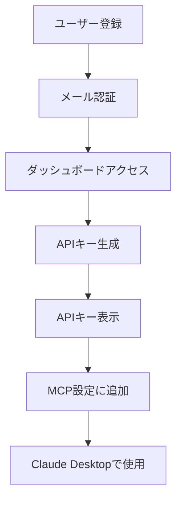

# MCP Server API Key Integration Guide

## 概要

このガイドでは、XBRL財務データAPIのMCPサーバーに第三者が自分のAPIキーを設定して使用する方法を説明します。

## 1. APIキーの取得

### 1.1 Vercel APIキーの取得

1. [XBRL API Dashboard](https://xbrl-api-minimal.vercel.app/dashboard) にアクセス
2. アカウントを作成またはログイン
3. ダッシュボードから「APIキー生成」をクリック
4. 生成されたAPIキー（例: `xbrl_live_abc123...`）を安全に保管

### 1.2 Supabase直接アクセス（上級者向け）

プレミアムプランのユーザーは、Supabaseに直接アクセスすることも可能です：

1. Supabaseプロジェクトの認証情報を取得
2. `SUPABASE_URL`と`SUPABASE_ANON_KEY`を設定

## 2. MCP設定方法

### 2.1 基本設定（Vercel API使用）

`claude_desktop_config.json`を以下のように設定：

```json
{
  "mcpServers": {
    "xbrl-financial": {
      "command": "npx",
      "args": ["@xbrl-jp/mcp-server"],
      "env": {
        "XBRL_API_KEY": "your_api_key_here",
        "XBRL_API_URL": "https://xbrl-api-minimal.vercel.app/api/v1",
        "API_MODE": "vercel"
      }
    }
  }
}
```

### 2.2 Supabase直接アクセス設定

```json
{
  "mcpServers": {
    "xbrl-financial-direct": {
      "command": "npx",
      "args": ["@xbrl-jp/mcp-server"],
      "env": {
        "SUPABASE_URL": "https://your-project.supabase.co",
        "SUPABASE_ANON_KEY": "your_anon_key_here",
        "SUPABASE_SERVICE_KEY": "your_service_key_here",
        "API_MODE": "supabase"
      }
    }
  }
}
```

### 2.3 ローカル開発環境

開発者向けのローカル設定：

```json
{
  "mcpServers": {
    "xbrl-local": {
      "command": "node",
      "args": ["./mcp-server/src/server.js"],
      "env": {
        "XBRL_API_KEY": "test_key_123",
        "XBRL_API_URL": "http://localhost:3000/api/v1",
        "API_MODE": "vercel"
      }
    }
  }
}
```

## 3. 環境変数の説明

| 環境変数 | 説明 | 必須 | デフォルト値 |
|---------|------|------|------------|
| `XBRL_API_KEY` | Vercel API用のAPIキー | Vercelモード時必須 | `xbrl_test_key_123` |
| `XBRL_API_URL` | APIエンドポイントのURL | いいえ | `https://xbrl-api-minimal.vercel.app/api/v1` |
| `API_MODE` | APIアクセスモード | いいえ | `vercel` |
| `SUPABASE_URL` | SupabaseプロジェクトURL | Supabaseモード時必須 | なし |
| `SUPABASE_ANON_KEY` | Supabase匿名キー | Supabaseモード時必須 | なし |
| `SUPABASE_SERVICE_KEY` | Supabaseサービスキー | Storage直接アクセス時必須 | なし |

## 4. 使用制限とプラン

### 無料プラン
- 100リクエスト/分
- 10,000リクエスト/時
- 100,000リクエスト/日
- 基本的な企業データアクセス

### プレミアムプラン
- 1,000リクエスト/分
- 100,000リクエスト/時
- 1,000,000リクエスト/日
- Supabase直接アクセス
- リアルタイムデータ更新
- 優先サポート

## 5. セキュリティ注意事項

### APIキーの管理

1. **APIキーを公開リポジトリにコミットしない**
2. **環境変数または設定ファイルで管理**
3. **定期的にキーをローテーション**
4. **使用しないキーは無効化**

### アクセス制御

- APIキーは個人/組織ごとに発行
- 各キーには使用制限とスコープを設定
- 不正使用が検出された場合は自動的に無効化

## 6. トラブルシューティング

### よくある問題

#### APIキーが無効と表示される

```bash
# 確認事項：
1. APIキーが正しくコピーされているか
2. APIキーが有効期限内か
3. 使用制限に達していないか
```

#### 接続エラー

```bash
# ネットワーク接続を確認
curl https://xbrl-api-minimal.vercel.app/api/health

# 環境変数を確認
echo $XBRL_API_KEY
```

#### レート制限エラー

```json
{
  "error": "Rate limit exceeded",
  "reset_at": "2025-09-01T12:00:00Z"
}
```

対処法：
- リクエスト間隔を調整
- プレミアムプランへのアップグレードを検討

## 7. サンプルコード

### Node.js での使用例

```javascript
// APIキーを使用したリクエスト
const API_KEY = process.env.XBRL_API_KEY;
const API_URL = 'https://xbrl-api-minimal.vercel.app/api/v1';

async function getCompanyData(companyId) {
  const response = await fetch(`${API_URL}/companies/${companyId}`, {
    headers: {
      'X-API-Key': API_KEY,
      'Content-Type': 'application/json'
    }
  });
  
  if (!response.ok) {
    throw new Error(`API error: ${response.status}`);
  }
  
  return await response.json();
}
```

### Python での使用例

```python
import os
import requests

API_KEY = os.environ.get('XBRL_API_KEY')
API_URL = 'https://xbrl-api-minimal.vercel.app/api/v1'

def get_company_data(company_id):
    headers = {
        'X-API-Key': API_KEY,
        'Content-Type': 'application/json'
    }
    
    response = requests.get(
        f"{API_URL}/companies/{company_id}",
        headers=headers
    )
    
    response.raise_for_status()
    return response.json()
```

## 8. APIキー発行フロー



## 9. 料金体系

| プラン | 月額料金 | APIリクエスト | Storage容量 | サポート |
|--------|---------|--------------|------------|---------|
| Free | ¥0 | 100,000/日 | - | コミュニティ |
| Basic | ¥980 | 1,000,000/日 | 10GB | メール |
| Pro | ¥4,980 | 10,000,000/日 | 100GB | 優先メール |
| Enterprise | お問い合わせ | 無制限 | カスタム | 専任担当 |

## 10. お問い合わせ

- **技術サポート**: support@xbrl-api.jp
- **営業問い合わせ**: sales@xbrl-api.jp
- **GitHub Issues**: https://github.com/ruisu2000p/xbrl-api-minimal/issues

---

最終更新: 2025年9月13日